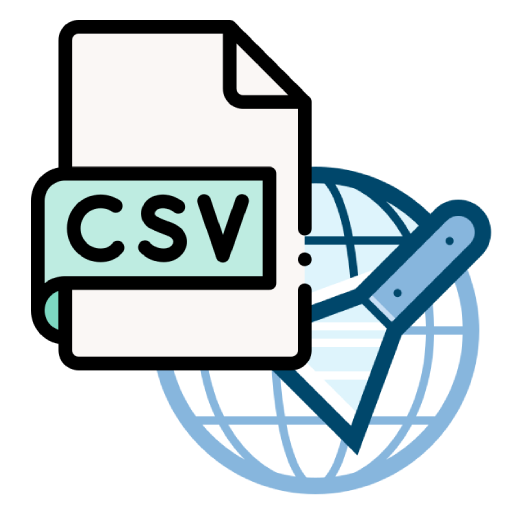

  # Web Scraping To CSV

  

    
  

  Proyek ini adalah sebuah aplikasi web scraping sederhana yang ditulis dalam bahasa Python. Aplikasi ini dapat melakukan crawling pada sebuah situs web, mengumpulkan URL yang valid, dan mengekstrak konten dari setiap URL tersebut.

  ## Fitur

  - Crawling URL secara rekursif dalam domain yang sama
  - Ekstraksi konten teks dari setiap halaman web
  - Penyimpanan hasil scraping dalam format CSV

  ## Persyaratan

  Untuk menjalankan aplikasi ini, Anda memerlukan:

  - Python 3.x
  - Beberapa library Python yang dapat diinstal menggunakan pip:
    - requests
    - beautifulsoup4
    - tqdm

  Anda dapat menginstal semua dependensi dengan menjalankan:

  pip install requests beautifulsoup4 tqdm

  ## Penggunaan

  Untuk menjalankan aplikasi, gunakan perintah berikut di terminal:

  python webscraping2csv.py <base_url> <output_file>

  Dimana:
  - `<base_url>` adalah URL dasar situs web yang ingin Anda scrape
  - `<output_file>` adalah nama file output (tanpa ekstensi .csv)

  Contoh:

  python webscraping2csv.py https://www.example.com hasil_scraping

  Hasil scraping akan disimpan dalam file CSV dengan nama `hasil_scraping.csv`.

  ## Struktur Proyek

  - `webscraping2csv.py`: File utama yang berisi semua fungsi untuk melakukan web scraping
    - `crawl_url()`: Fungsi untuk melakukan crawling URL
    - `get_url_content()`: Fungsi untuk mengekstrak konten dari URL
    - `webscraping()`: Fungsi utama yang menjalankan proses scraping dan menyimpan hasilnya

  ## Catatan

  - Pastikan untuk mematuhi kebijakan dan persyaratan layanan dari situs web yang Anda scrape.
  - Gunakan aplikasi ini dengan bijak dan bertanggung jawab.

  ## Kontribusi

  Kontribusi untuk proyek ini sangat diterima. Jika Anda memiliki saran atau perbaikan, silakan buat pull request atau buka issue.

  ## Lisensi

  [MIT License](LICENSE)